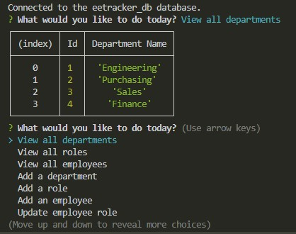

# Employee_Tracker

## Description
The Employee Tracker application allows users to manage their company's employee database by adding employees or modifying information like salery, titles, managers and departments.

## Table of Contents

- [Installation](#installation)
- [Usage](#usage)
- [Contributing](#contributing)
- [License](#license)

## Installation
To install my project use the following link: https://github.com/dianavw8/Employee_Tracker and follow these simple directions:

Above the list of files, click on the "Code" button.

Copy the URL for the repository.

Open Git Bash.

Change the current working directory to the location where you want the cloned directory.

Type git clone, and then paste the URL you copied earlier.

Press Enter to create your local clone.

For more help and information achiving this, check out the following website: https://docs.github.com/en/repositories/creating-and-managing-repositories/cloning-a-repository

## Usage
The following image demonstrates the application's appearance and functionality:

## License

MIT License link: https://github.com/babel/babel/blob/master/LICENSE

## Contributing

The following are contributers to the making of the Employee Tracker:

https://shields.io/

https://choosealicense.com/

https://coding-boot-camp.github.io/full-stack/github/professional-readme-guide

https://opensource.org/licenses## License
